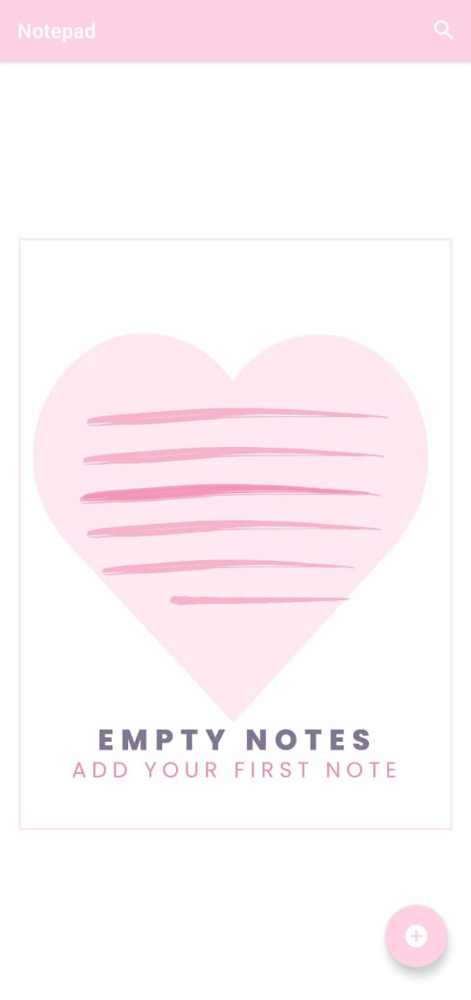
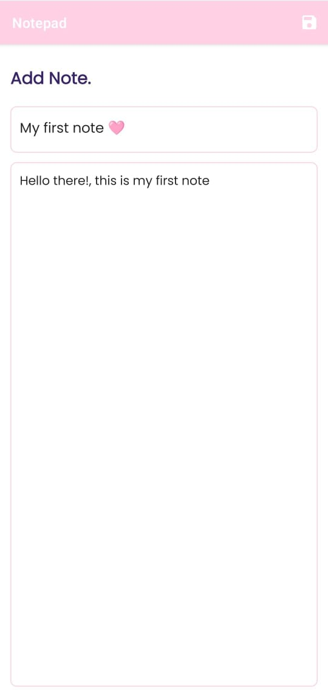
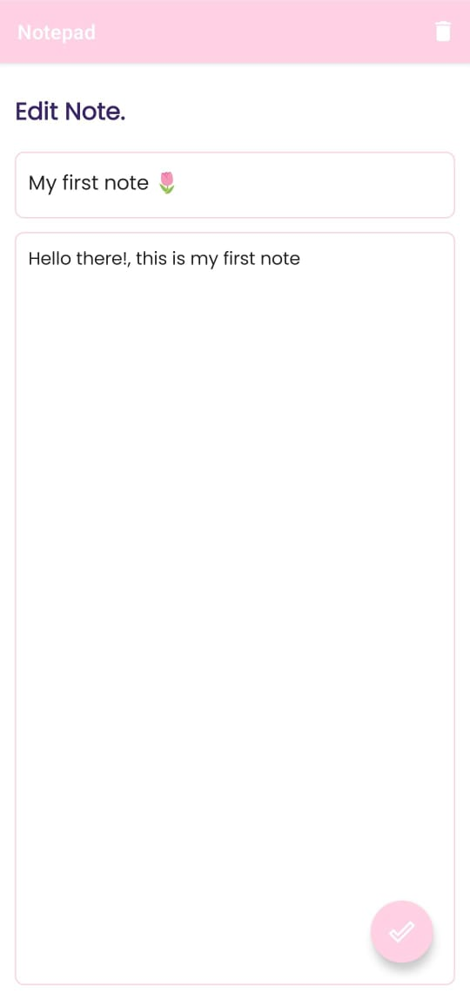
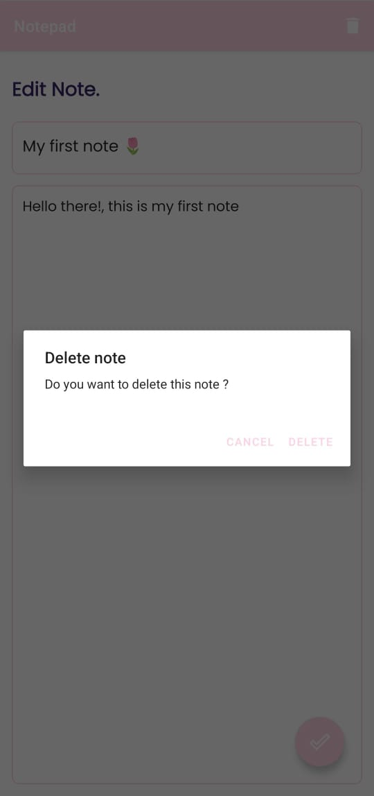
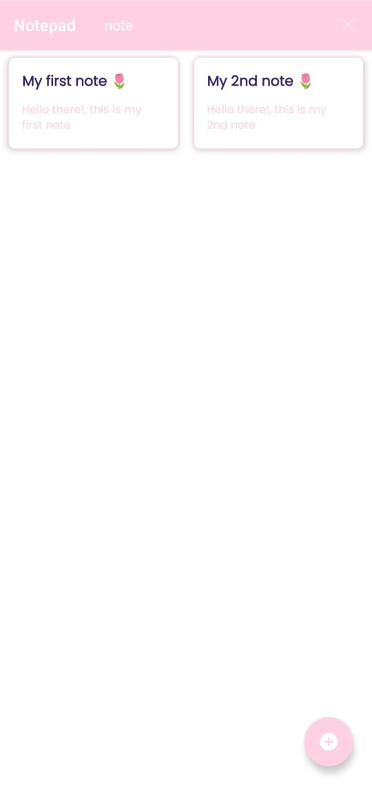

# Notepad
Nota app build by kotlin and android SDK for android applications 

# This app demonstrates fundamental Android development concepts including:
- using list item
- recycler viwes
- adapter
- Fragments
- Kotlin Coroutines
- Room database
- MVVM Architecture

# Key features:
- Add notes, update or delete them
- Search notes
- 
# App snapshots 

